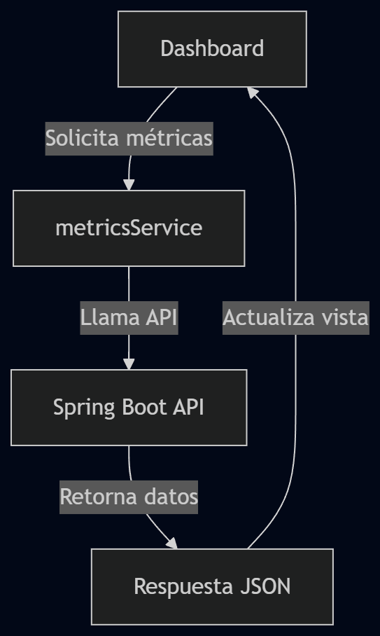

# M6_AdvanceWer_ActividadClase_AnalisisCodigoFrancisco

# Cambios implementados

### Front

Se agreo mas tablas para poder visualizar todas las opciones que ofrece el controlador de metricas. Tambien se agrego la opcion de registrar entradas de datos desde el front para registrar en la base de datos

### Back

Se modifico el controlador, servicio, repositorio y entidad de metricas para soportar posts desde react y registro de datos en una base de datos (h2)

#### Base de datos H2

Se configuro una base de datos local la cual guarda sus datos en /demo/data/metricsdb.mv/db. Esto se hace para evitar que cada vez que se reinicie la applicacion de spring los datos no se pierdan. Esto definitivamente trearia problemas en un projecto de mayor escala al aumentar el acoplamiento de los componentes de la applicacion pero para el alcance de esta es una solucuion adecuada

# Analisis inicial del codigo

### Backend Spring Boot

### Estructura general del proyecto

Arquitectura cliente-servidor utilizando spring boot como servidor de backend

### Función de las capas

### Controllers

- MetricsController.java: controlador para acceder a las metricas como horas, tareas etc.

### Service

- MetricsService.java: logica de negocios es definida aqui y llamada por su controlador conrespondiente

### Repository

- DeveloperMetricRepository.java: Sirve para manejar la base de datos y metodos de una entidad. De momento no hay coneccion con base de datos y las entradas estan hardcodeadas

### Model

- DeveloperMetric.java: define la estructura de datos de las matricas para los repositorios

### DTO

DTOs sirven para transferir datos entre componentes y servicios - clientes.

- MetricRequestDTO.java: Contiene datos enviados desde el frontend. Regularmente request DTOs se usan en post o updates mapping, no en get mapping, el unico mappeo en el controller, por lo que este DTO no es usado en ninguna parte del codigo.
- MetricResponseDTO.java: Define la estructura de datos para enviar al frontend que lo resirvira como un json.

### Config

- CorsConfig.java: Define que origins puede acceder a su api (localhost:5173) y que metodos se permiten (GET, POST, PUT, DELETE, OPTIONS)
- SecurityConfig.java: Authorizacion de metodos

<!--
**Main Problems**

- MetricRequestDTO.java is unused and unnecessary because the frontend does not need a data transfer objects to send requests to the backend. This file should be deleted
- MetricResponseDTO.java is duplicated in the folders model and repository. Only the one in model is needed and used, the other should be deleted.
- Data is currently hard written in the repository.java. It should be accessed through a database.
-->

### Frontend React

### Estructura de carpetas

```text
productivity-dashboard/
├── public/
│   ├── favicon.svg
│   └── icons.svg
├── src/
│   ├── assets/
│   │   ├── hero.png
│   │   ├── react.svg
│   │   └── vite.svg
│   ├── component/
│   │   └── Dashboard.jsx
│   ├── services/
│   │   └── metricsService.js
│   ├── App.jsx
│   ├── App.css
│   ├── main.jsx
│   └── index.css
├── package.json
└── vite.config.js
```

### Descripción

- assets/: contiene imagenes utilizadas por la aplicacion
- component/: almacena los componentes para renderizar
- services/: centraliza la comunicación con el backend mediante llamadas HTTP

## Componentes principales

- App.jsx: Componente raiz de la aplicacion. carga los demas componentes y el cuerpo principal
- Dashboard.jsx: Componente principal del sistema, muestra datos importantes de las metricas y la grafica
- metricsService.js: Unico componente no visual, solo se utiliza para comunicacion con la API REST

## Manejo de hooks

Se hace uso de 2 hooks en la dashboard

- useEffect: para cargar los datos de la api SOLO UNA VEZ ([]) y la guarda en el siguiente hook
- useState: Empieza como un arreglo vacio y se usa para giuardar los datos de las metrics

## Flujo de datos



## Vizualizacion de datos

Actualemte solo se usa una tabla para mostrar los datos de la dashboard. En esta nomas se desplegan informacion de commits. Una mejora seria agregar varias tablas para las demas metricas o hacer posible el cambio de metricas de la tabla

<!--
- Application does not use the other metrics of the api.
- Front doesnt use Useeffect, if the fetch takes longer than expected the render of the graph could fail
-->
